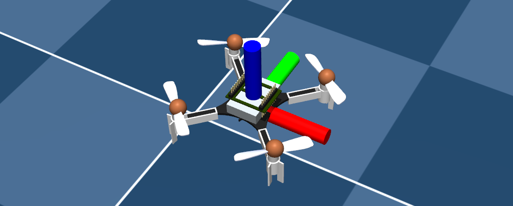
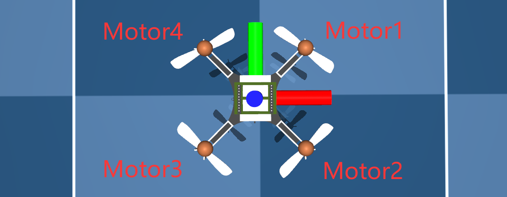

## ACADOS NMPC Quadrotor Position Control Demo
export MUJOCO_GL="egl"
export PYOPENGL_PLATFORM="egl"
## ����ģ��

```python
    g0  = 9.8066     # [m.s^2] accerelation of gravity
    mq  = 33e-3      # [kg] total mass (with one marker)
    Ixx = 1.395e-5   # [kg.m^2] Inertia moment around x-axis
    Iyy = 1.395e-5   # [kg.m^2] Inertia moment around y-axis
    Izz = 2.173e-5   # [kg.m^2] Inertia moment around z-axis
    Cd  = 7.9379e-06 # [N/krpm^2] Drag coef
    Ct  = 3.25e-4    # [N/krpm^2] Thrust coef
    dq  = 65e-3      # [m] distance between motors' center
    l   = dq/2       # [m] distance between motors' center and the axis of rotation

```

���ת�ٷ�Χ��0-22krpm

Cd����������Ťϵ��

Ct������������ϵ��

����������������

$$
F_{max}=C_t\cdot\omega_{max}^2=3.25\times10^{-4}\times22^2=0.1573N
$$

����������Ť��

$$
M_{max}=C_d\cdot\omega_{max}^2=7.9379\times10^{-6}\times22^2=3.842\times10^{-3}N\cdot m
$$

��mujoco��Actuatorʹ�ù�һ�����룬���е���������뷶ΧΪ0-1��

```xml
  <actuator>
    <motor class="cf2" ctrlrange="0 1" gear="0 0 0.1573 0 0 -3.842e-03" site="motor1_site" name="motor1"/>
    <motor class="cf2" ctrlrange="0 1" gear="0 0 0.1573 0 0 3.842e-03" site="motor2_site" name="motor2"/>
    <motor class="cf2" ctrlrange="0 1" gear="0 0 0.1573 0 0 -3.842e-03" site="motor3_site" name="motor3"/>
    <motor class="cf2" ctrlrange="0 1" gear="0 0 0.1573 0 0 3.842e-03" site="motor4_site" name="motor4"/>
  </actuator>
```

����siteΪ����ڻ�������ϵ�е�����

�����ת�����Լ���ţ� ��ɫ ��ɫ ��ɫ �ֱ�Ϊ��������ϵ x y z��





����Motor4��Motor2˳ʱ����ת��Motor1��Motor3��ʱ����ת��

## ����ѧ

������Ԫ������ӻ�������ϵת������������ϵ����ת����

$$
R_b^w=
\begin{bmatrix}
1-2q_2^2-2q_3^2  & 2(q_1\cdot q_2-q_0\cdot q_3) & 2(q_1\cdot q_3 + q_0\cdot q_2) \\ 
2(q_1\cdot q_2 + q_0\cdot q_3)  & 1-2q_1^2-2q_3^2 & 2(q_2\cdot q_3 - q_0\cdot q_1)\\
2(q_1\cdot q_3 - q_0\cdot q_2)  & 2(q_2\cdot q_3 + q_0\cdot q_1) & 1-2q_1^2-2q_2^2
\end{bmatrix}
$$

### ��Ԫ����

С�Ƕȱ仯����£���Ԫ��΢С�仯�������±�ʾ��

$$
\Delta q=
\begin{bmatrix}
1 \\ \frac{\Delta \theta}{2} 
\end{bmatrix}
$$

$$
\Delta \theta = \boldsymbol \omega\cdot dt
$$

�˽Ƕȱ仯����ֱ���������Dz������㣬Ϊ��������ϵ�еĽǶȱ仯����

������Ԫ����

$$
q\otimes \Delta q= \frac{1}{2}
\begin{bmatrix}
0  & -\Delta \theta_x & -\Delta \theta_y & -\Delta \theta_z\\
\Delta \theta_x  & 0 & \Delta \theta_z & -\Delta \theta_y\\ 
\Delta \theta_y  & -\Delta \theta_z & 0 & \Delta \theta_x\\
\Delta \theta_z  & \Delta \theta_y & -\Delta \theta_x & 0
\end{bmatrix}
$$

��Ԫ�������󵼣�

$$
q{}' = \frac{1}{2} 
\begin{bmatrix}
 0 & -\omega_x & -\omega_y & -\omega_z\\
\omega_x  & 0 & \omega_z & -\omega_y\\
\omega_y  & -\omega_z & 0 & \omega_x\\
\omega_z  & \omega_y & -\omega_x & 0
\end{bmatrix}
$$

����ʵ�֣�

```python
    dq0 = -(q1*wx)/2 - (q2*wy)/2 - (q3*wz)/2
    dq1 =  (q0*wx)/2 - (q3*wy)/2 + (q2*wz)/2
    dq2 =  (q3*wx)/2 + (q0*wy)/2 - (q1*wz)/2
    dq3 =  (q1*wy)/2 - (q2*wx)/2 + (q0*wz)/2
```

### ���ٶ���

���嶯��ѧ����ŷ�����̣� MΪ��������Ť������

$$
\mathrm {M}=\mathrm{I}\dot{\boldsymbol \omega} +\boldsymbol \omega\times(\mathrm{I}\boldsymbol \omega)
$$

�Ӷ��õ����ٶ�΢��Ҳ���ǽǼ��ٶȵĹ�ʽ��

����ʵ�֣�

```python
dwx = (mx + Iyy*wy*wz - Izz*wy*wz)/Ixx
dwy = (my - Ixx*wx*wz + Izz*wx*wz)/Iyy
dwz = (mz + Ixx*wx*wy - Iyy*wx*wy)/Izz
```

����Ť�ر���ʽ��

```python
mx = Ct*l*(  w1**2 - w2**2 - w3**2 + w4**2)
my = Ct*l*( -w1**2 - w2**2 + w3**2 + w4**2)
mz = Cd*  ( -w1**2 + w2**2 - w3**2 + w4**2)
```

1.Motor1 Motor4ʹ�û���������X��������ת Motor2 Motor3ʹ��ʹ�û���������X��������ת

2.Motor1 Motor2ʹ�û���������Y��������ת Motor3 Motor4ʹ��ʹ�û���������Y��������ת

3.Motor1 Motor3����˳ʱ�뷴Ť Motor2 Motor4������ʱ�뷴Ť(��ʱ��Ϊ��)

### ���

�����ٶ�

### �ٶ���

�������ĸ�������������������ػ�������ϵZ�ᣬ������ת������������ϵ���ټ�����������

## NMPC

ʹ��13ά��״̬������

```python
x = vertcat(px, py, pz, q0, q1, q2, q3, vx, vy, vz, wx, wy, wz)
```

px, py, pz: ��������ϵλ��

q0, q1, q2, q3:��Ԫ��

vx, vy, vz:��������ϵ�ٶ�

wx, wy, wz: ��������ϵ���ٶ�

ʹ��4ά������������Ҳ�����ĸ������ת�����룬��λkrpm:

```python
u = vertcat(w1, w2, w3, w4)
```
